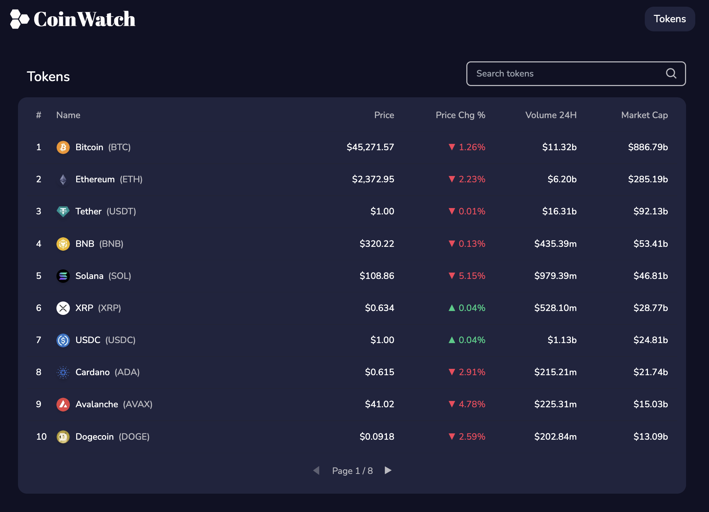
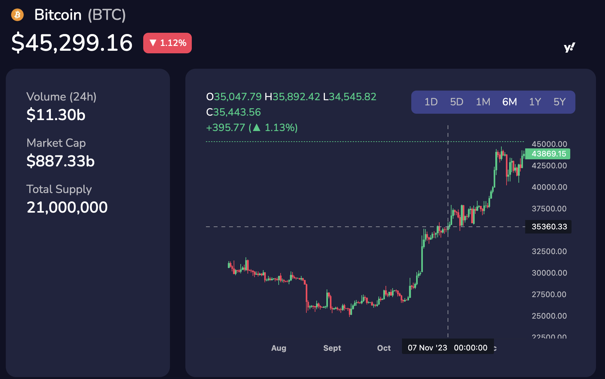

# Coinwatch

**Coinwatch** allows you to view the latest prices of cryptocurrencies.





## Usage

### Run locally

```bash
# db
docker compose up -d db

# backend
cd backend
mvn spring-boot:run

# frontend
cd frontend
npm run build
npm run start
```

### Run with Docker

```bash
docker compose up -d
```

Then, you can access the application on `http://127.0.0.1:3000`.